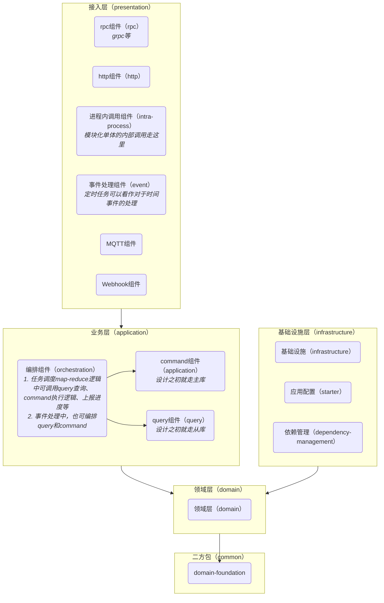

[](https://deepwiki.com/mengqiang81/latest)

# ERP系统最佳实践验证
[新一代架构白皮书](https://www.yuque.com/chigui-fp7qz/kb/aci991egzg5xw016)的应用实现

## Features
* [ ] 分层架构
  * [x] 依赖都指向那些我们不想经常更改的组件，多态（安全的函数指针）可以让源码依赖关系和系统控制流解耦
  * [ ] 在Java这类静态类型的编程语言中，在使用use、import、include这些语句时应该只引用那些包含接口、抽象类或者其他抽象类型声明的源文件，不应该引用任何具体实现。类似于C中的include xx.h 而非 xx.c
* [ ] 模块化单体
* [ ] Native Image
  * [ ] Native Image 的 G1 Region 大小在编译时确定（因堆大小固定），运行时无法调整。(可编译多个镜像版本用于应急)
* [ ] 常用中间件最佳实践
* [ ] OpenTelemetry
* [ ] 事务管理
  * [ ] 对于业务可感知的单一一次操作，当为模块化单体架构时，使用进程内事务，当拆分为独立微服务时，使用XA事务（少数情况使用TCC模式）
  * [ ] 对于多步操作，如生成采购单后生成暂估应付，使用流程引擎编排和TCC模式（少数情况考虑Saga模式）
* [ ] 流程编排
  * [ ] 同步的用户体验，不代表同步的业务调用。比如采购审核通过生成暂估应付，未生成则审核无法通过。为了解耦采购和财务，采购域仍然是发出一个审核预通过状态，流程编排引擎可以编排审核通过和暂估应付的业务事务逻辑（TCC），审核通过和发货单生成的最终一致逻辑（最终一致性），但是在API交互上，可以同步等待暂估应付的流程完结再返回审核成功还是失败。
  * [ ] 流程编排的起点是command而非event
* [ ] 发布管理
  * [ ] Liquibase管理数据库变更
* [ ] 权限
  * [ ] API和功能点/权限点的关系（RBAC），RBAC 用@PreAuthorize 静态声明描述，元数据对应权限点@PreAuthorize("hasPermission('Order', 'DELETE')")
  * [ ] 数据权限（ABAC）
* [ ] 读写分离
  * [ ] doris物化视图+逻辑视图实现列表查询的无感读写分离，原理是1:1创建doris表，然后创建物化视图宽表（join），然后1:1创建逻辑视图，利用doris完全兼容mysql语法的特定查逻辑视图，doris会自动转为查物化视图
* [ ] 前端低代码
* [ ] 后端元数据
* [ ] Only API，所有数据同步使用事件契约（CNCF事件标准），一切宽表类查询加速使用事件接口契约作为原数据表，下游有几种做法:
  1. 根据对方域的事件契约在自己域创建缓存表；
  2. 一个是直接进入流式计算写入一个共享的契约表（API的物理实现），契约表可以关联查询，而流式计算脚本各域自行编写属于内部逻辑
    * 这个方案有缺点，同步脚本要具备版本化的能力比较困难，不像下面的事件可以回放什么的，有问题可能只能重建全量数据
    * 跟第一个方案笔也有缺陷，就是业务域也要进doris，而第一个方案可能只需要mysql就能搞定了，因为大部分场景都是业务域缓存基础域，很少需要业务域互相缓存
  3. 上一个版本的复杂实现，各域在自己这里创建契约表，然后把契约表直接同步进doris
  4. 所以不妨再来一个方案，通过流式计算脚本双写，在自己域维护一个契约表，同时写进doris，业务域通过dts把基础域的契约表同步到自己这里，想用mysql的时候就用这个表，想用doris的时候再把自己的业务单据同步进doris
  5. 通过完善的工具，以上方案可以同时实现，根据情况选择，现在看来4比较完美
* [ ] 定义字段变更契约，明确表达哪个字段发生了变化。
* [ ] 测试Hibernate Envers用于审计
* [ ] GraphQL
* [ ] 虚拟化线程
* [ ] ADT（vavr（不推荐） 或 sealed class + record）
* [ ] DDD
* [ ] 分区表
* [x] 代码即文档（https://codewiki.google/）
  * https://deepwiki.com/mengqiang81/latest
* [ ] 脚本（graalJS）
* [ ] 规则引擎（Drools）
* [ ] 流程引擎（camunda）
* [ ] 国际化（异常信息，术语，规则引擎DSL等等）
* [ ] 大数据量导出（临时表+游标优化分页查询，缓存防并发，explain估算量级）
* [ ] 多维分析（Kylin+MDX，存储考虑doris而非hbase）
* [ ] 通用starter（如i18n）

## 分层架构
### 原则
* 用maven module分层，用package分微服务（模块化单体）
* 必须仔细处理依赖，跨层依赖，同层不依赖，无循环依赖，依赖倒置等,架构定好的层级依赖关系不得打破
* 每一层都按业务域分包，不存在跨业务域的内容(除Application类和二方包外)
    * 每个东西的入口点都应该由相应业务域的团队去维护，他可以选择使用不同的基础设施，但是职责不在基础设施团队（平台服务化）

### 架构图

[//]: # (```plantuml)

[//]: # (@startuml)

[//]: # (!include ./docs/architecture.puml)

[//]: # (@enduml)

[//]: # (```)


## Quick Start
* 执行 common下domain-fundation的publishToMavenLocal

## Q&A
* Q: 为什么只有interfaces为复数？
* A: interfaces 下的子模块是 **“不同类型的交互入口”**（API、消息、RPC 等），这些入口是 “平行且独立的集合”

* Q：实现了什么例子
* A：实现了一个交易域和库存域交互的例子，主要包括了拍占付减的逻辑